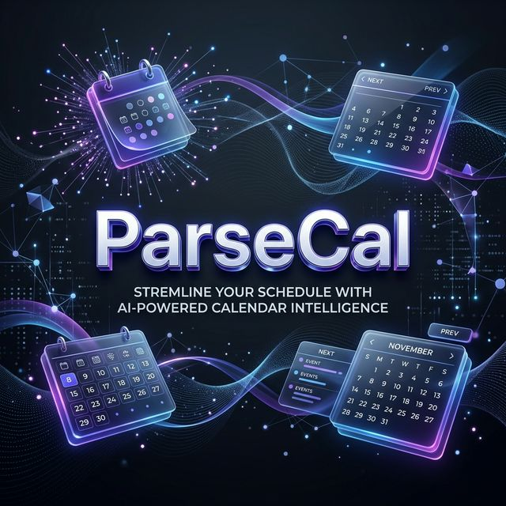

<div align="center">
  

  # 📅 ParseCal
  ### *Streamline Your Schedule with AI-Powered Calendar Intelligence*

  [](https://nextjs.org/)
  [](https://tailwindcss.com/)
  [](https://supabase.com/)
  [](https://ai.google.dev/)

  ---

  **ParseCal** is a high-performance, AI-driven utility designed to eliminate the friction of manual calendar entry. Drop any schedule — a university timetable, conference agenda, meeting list, or just some messy text — and let AI do the heavy lifting. Review the extracted events, tweak what you need, and push them straight to **Google** or **Outlook Calendar**.

  [**Explore the Repo**](https://github.com/nodesagar/parsecal) • [**Report a Bug**](https://github.com/nodesagar/parsecal/issues) • [**Request a Feature**](https://github.com/nodesagar/parsecal/issues)

</div>

## 🚀 The Multi-Modal AI Extraction Flow

ParseCal treats your schedules with clinical precision. It doesn't just "read" text; it understands structure, detects intents, and resolves temporal ambiguities.

1.  **Ingestion:** Upload a PDF, image, or paste an unstructured text dump.
2.  **Extraction:** LLMs (Gemini, Claude, GPT-4o, Minimax) extract structured event data.
3.  **Refinement:** Automatic timezone detection and date normalization.
4.  **Review:** A sleek, interactive dashboard to edit and confirm details.
5.  **Sync:** Instant push to Google Calendar or Microsoft Outlook via OAuth2.

---

## ✨ Features

- 📄 **Multi-format Support** — High-fidelity parsing from PDFs, images, and raw text.
- 🤖 **AI Cascade extraction** — Gemini (primary), OpenAI, Claude, and Minimax with automatic fallback for maximum reliability.
- ✏️ **Event Review & Editing** — Granular control over titles, times, locations, and recurrence rules.
- 📆 **Ecosystem Integration** — OAuth-based push to Google and Outlook Calendar.
- 📥 **ICS Export** — Download standard `.ics` files for use with any other calendar app.
- 🔍 **Audit Trail** — Search, filter, and manage all your historical parsing sessions.
- 🚦 **Safety & Resilience** — Rate limiting and email authentication powered by Supabase.

---

## 🛠️ Tech Stack

| Layer | Technology |
| :--- | :--- |
| **Framework** | [Next.js 16](https://nextjs.org/) (App Router, Server Actions) |
| **Styling** | [Tailwind CSS 4](https://tailwindcss.com/) |
| **Database** | [PostgreSQL](https://www.postgresql.org/) (via [Supabase](https://supabase.com/)) |
| **Authentication** | [Supabase Auth](https://supabase.com/auth) |
| **AI Layer** | Gemini API, OpenAI SDK, Anthropic SDK, Minimax |
| **Calendar** | Google Calendar API, Microsoft Graph API, `ical-generator` |

---

## 📦 Getting Started

### 1. Prerequisites
- Node.js 18+
- A [Supabase](https://supabase.com) project
- At least one AI provider API key (Gemini recommended)

### 2. Setup
```bash
git clone https://github.com/nodesagar/parsecal.git
cd calendarai
npm install
```

### 3. Environment Configuration
Create a `.env.local` file and populate it with your credentials:

```bash
# Supabase
NEXT_PUBLIC_SUPABASE_URL=your_supabase_url
NEXT_PUBLIC_SUPABASE_ANON_KEY=your_anon_key

# Intelligence Providers
GEMINI_API_KEY=your_gemini_key
OPENAI_API_KEY=your_openai_key
ANTHROPIC_API_KEY=your_anthropic_key
MINIMAX_API_KEY=your_minimax_key

# OAuth Redirects
GOOGLE_CALENDAR_CLIENT_ID=your_client_id
GOOGLE_CALENDAR_CLIENT_SECRET=your_client_secret
MICROSOFT_CLIENT_ID=your_client_id
MICROSOFT_CLIENT_SECRET=your_client_secret
NEXT_PUBLIC_APP_URL=http://localhost:3000
```

### 4. Database Setup
Run the migrations located in `supabase/migrations/` in your Supabase SQL Editor.

### 5. Launch
```bash
npm run dev
```

Open [http://localhost:3000](http://localhost:3000).

---

## 📁 Project Structure

```bash
src/
├── app/
│   ├── (auth)/           # Authentication flows (Login, Signup)
│   ├── (protected)/      # Application Dashboard and Settings
│   └── api/              # Ingestion, Sync, and Validation endpoints
├── components/
│   ├── dashboard/        # Advanced session list and filtering logic
│   └── ui/               # Reusable primitive UI components
├── lib/
│   ├── ai/               # AI provider abstraction layer
│   ├── calendar/         # Integration wrappers for Google/Outlook
│   └── supabase/         # Data persistence and auth helpers
└── types/                 # Domain-driven TypeScript definitions
```

---

## 🧠 Why Build This?

I kept getting event schedules in formats that were anything but calendar-friendly — PDFs from university, event flyers, or text dumps from group chats. Manually creating each event felt like a crime against productivity. So I built ParseCal to do it for me. It’s about spending less time entering data and more time doing what’s on your schedule.

---

## 📬 Contact

**Sagar**  
[](https://x.com/nodesagar)
[](https://linkedin.com/in/nodesagar)
[](https://github.com/nodesagar)

---

<div align="center">
  Built with ❤️ and ☕ by <b>nodesagar</b>
</div>
