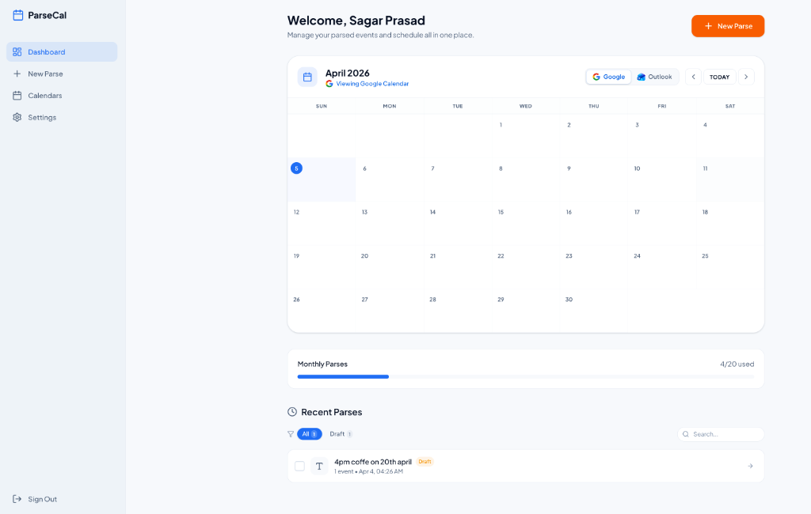

<div align="center">

# 📅 ParseCal

### *Turn PDFs, images, and text into calendar events — powered by AI.*

[](https://nextjs.org/)
[](https://www.typescriptlang.org/)
[](https://tailwindcss.com/)
[](https://supabase.com/)

<br />



</div>

---

## 💡 The Problem

Ever received a class timetable as a PDF, a screenshot of a meeting invite, or a messy text dump from a group chat and wished it would just *appear* in your calendar?

Manual entry is a crime against productivity. **ParseCal** fixes this.

## ✨ Core Features

- 📄 **Universal Input** — Extract schedules from PDFs, images (even messy whiteboard photos), or plain text.
- 🤖 **Multi-Model AI** — Powered by **Gemini 1.5 Pro** (Primary), with fallback support for **OpenAI GPT-4o** and **Claude 3.5 Sonnet**.
- ✏️ **Smart Review** — AI extracts titles, dates, times, locations, and recurrence rules. You review and tweak before finalizing.
- 📆 **Direct Integration** — Push events directly to **Google Calendar** via OAuth2 or **Outlook** (coming soon).
- 📥 **Universal Export** — Download standard `.ics` files compatible with Apple Calendar, Outlook, and more.
- 🔍 **Dossier Management** — Search, filter by status, multi-select, and bulk manage your parsed sessions.
- 🚥 **Rate Limiting** — Production-ready balancing with per-user, per-IP, and global daily limits.

## 🛠️ Tech Stack

| Layer | Technology |
| :--- | :--- |
| **Framework** | Next.js 16 (App Router) |
| **Language** | TypeScript + Zod |
| **Styling** | Tailwind CSS 4 (Industrial Minimalist) |
| **Backend** | Supabase (PostgreSQL, Auth, Storage) |
| **Intelligence** | Google Gemini, OpenAI, Anthropic |
| **Calendar** | Google Calendar API + ical-generator |
| **Icons** | Lucide React |

## 🚀 Getting Started

### Prerequisites

- **Node.js 18+**
- A **Supabase** project (Auth & Database)
- At least one AI Provider Key (**Gemini** recommended)
- **Google Cloud Console** project with Calendar API enabled

### 1. Clone & Install

```bash
git clone https://github.com/nodesagar/parsecal.git
cd parsecal
npm install
```

### 2. Configure Environment

Create a `.env.local` file in the root:

```env
# Supabase
NEXT_PUBLIC_SUPABASE_URL=your_supabase_url
NEXT_PUBLIC_SUPABASE_ANON_KEY=your_anon_key
SUPABASE_SERVICE_ROLE_KEY=your_service_role_key
SUPABASE_UPLOADS_BUCKET=uploads

# AI Providers
GEMINI_API_KEY=your_gemini_key
OPENAI_API_KEY=your_openai_key
ANTHROPIC_API_KEY=your_anthropic_key

# Google OAuth
GOOGLE_CLIENT_ID=your_client_id
GOOGLE_CLIENT_SECRET=your_client_secret
GOOGLE_REDIRECT_URI=http://localhost:3000/api/auth/calendar/google/callback
```

### 3. Database Initialization

Execute the migrations found in `supabase/migrations/` within your Supabase SQL Editor:

- `001_initial_schema.sql`
- `002_add_session_title.sql`
- `003_add_uploads_storage_bucket.sql`

### 4. Launch

```bash
npm run dev
```

Visit [localhost:3000](http://localhost:3000) to start parsing.

## 📁 Project Architecture

```bash
src/
├── app/                  # Next.js App Router (Auth/Protected/API)
├── components/           # UI Design System (Dashboard/Parse/Review)
├── lib/                  # Core Logic (AI Abstraction, Calendar, Supabase)
├── hooks/                # Custom React Hooks
└── types/                # Strict Type Definitions
```

---

<div align="center">
  <p>Built with ❤️ and ☕ by <b>Sagar</b></p>
  <p>
    <a href="https://twitter.com/nodesagar">Twitter</a> • 
    <a href="https://github.com/nodesagar">GitHub</a> • 
    <a href="https://linkedin.com/in/nodesagar">LinkedIn</a>
  </p>
  <p><i>If ParseCal saved you time, consider giving it a ⭐!</i></p>
</div>
